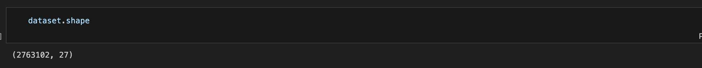
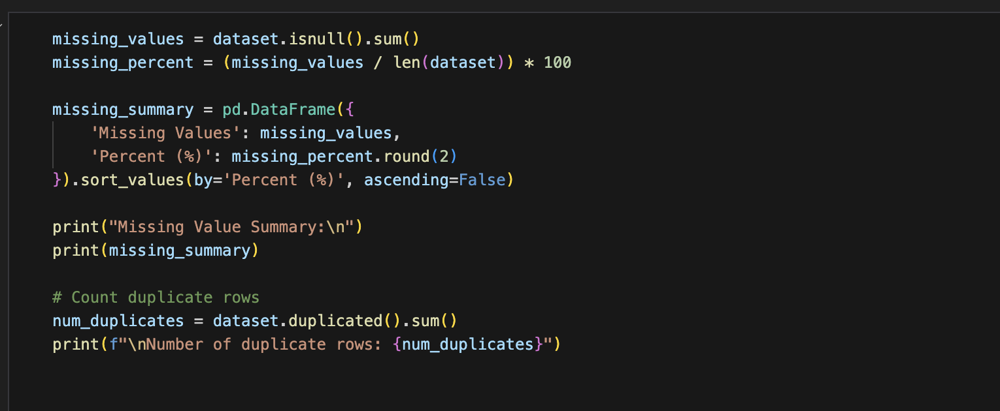
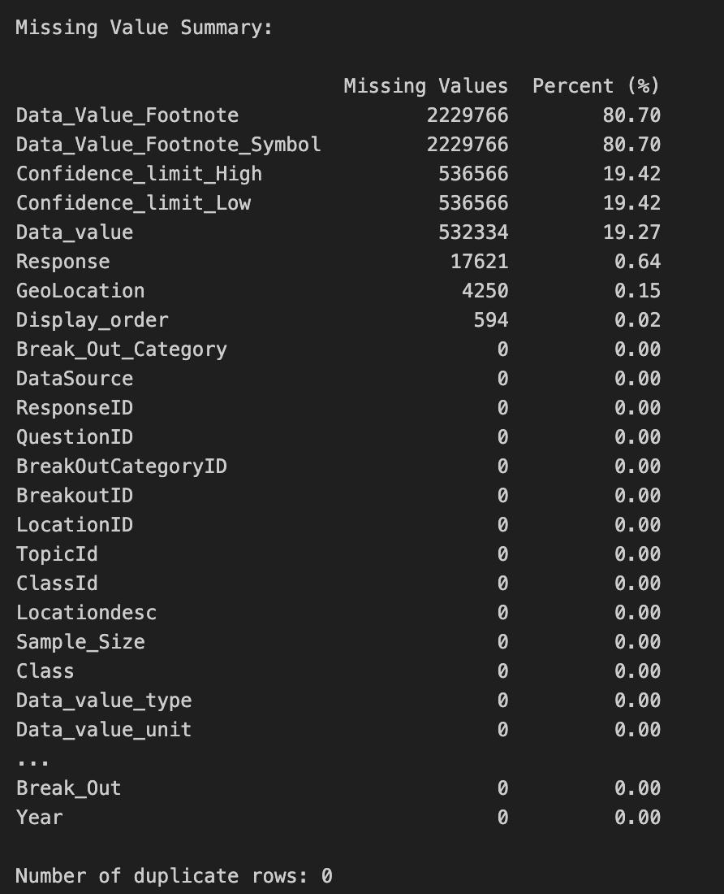
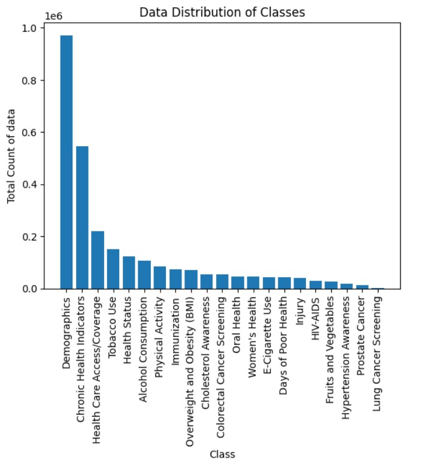
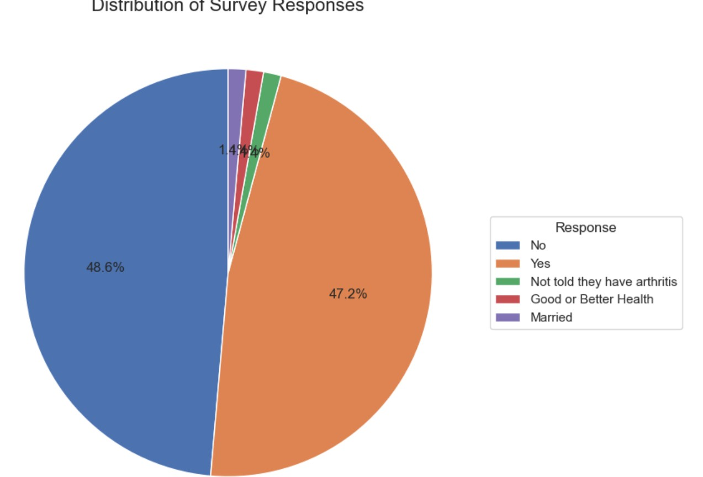
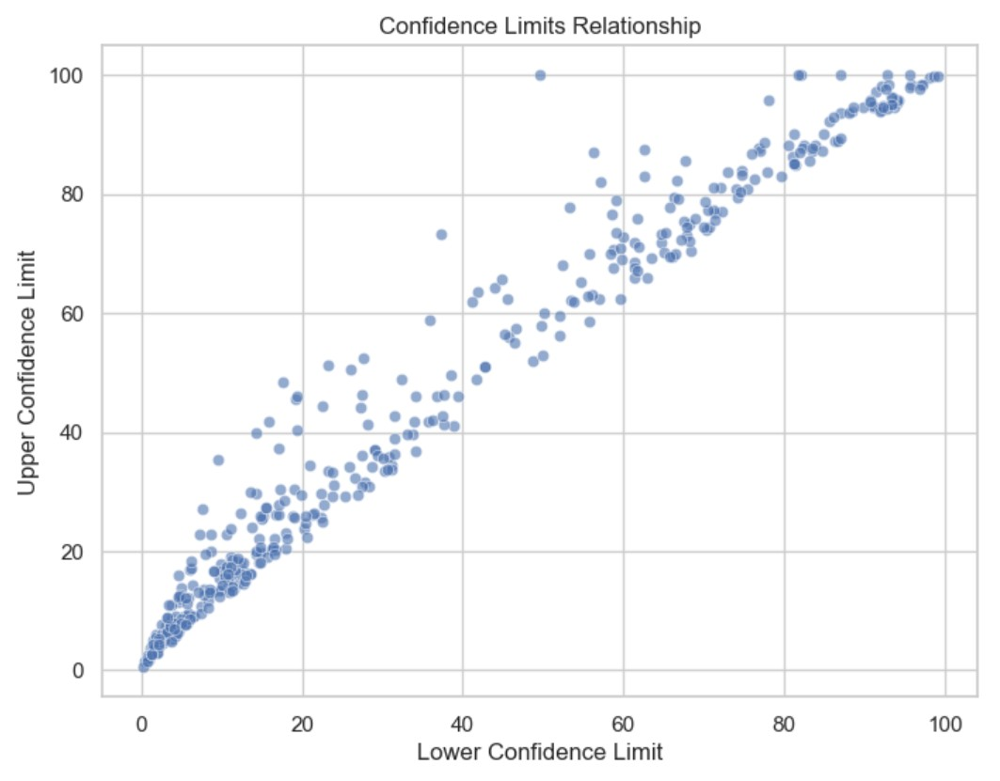
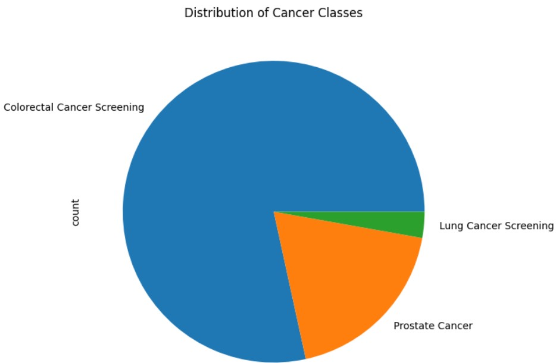
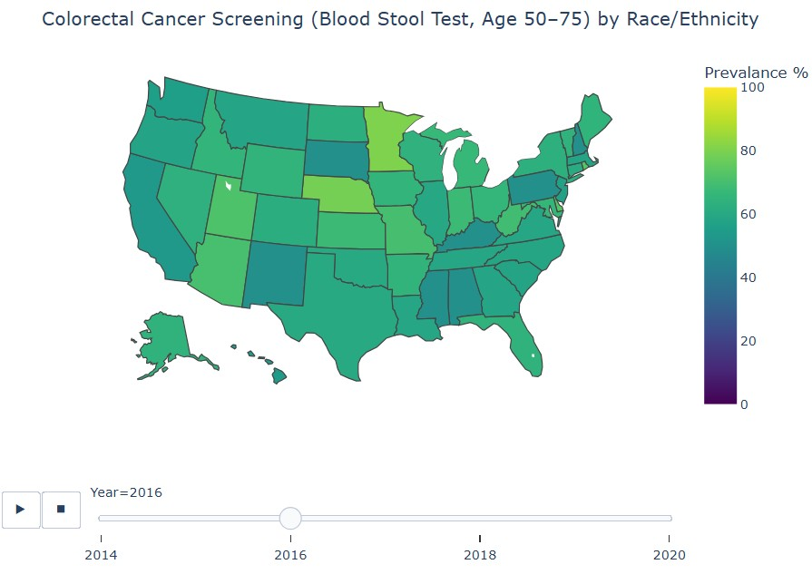
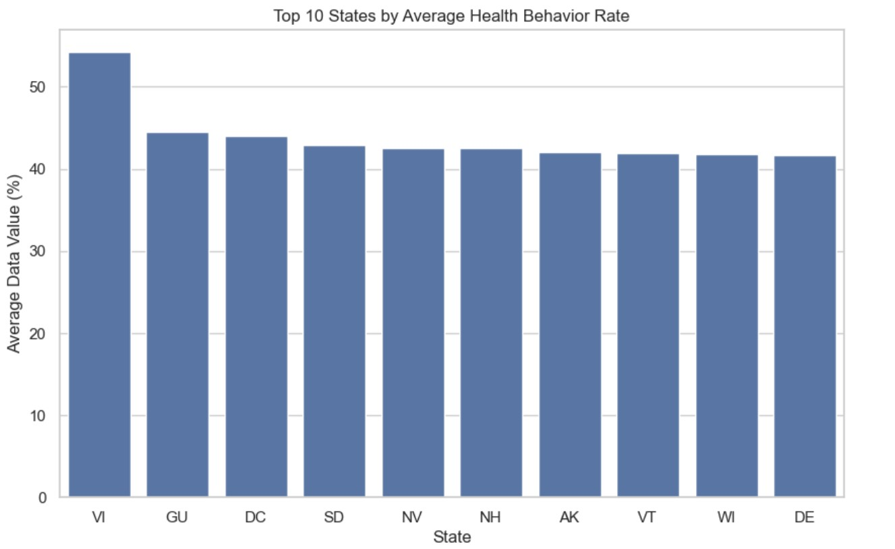

# Center for Disease Control and Prevention, Behavioral Risk Factor Surveillance System
## DSE 203 - Machine Learning
## Milestone 3 - Pre-Processing and First Model
### Dataset link
* https://data.cdc.gov/Behavioral-Risk-Factors/Behavioral-Risk-Factor-Surveillance-System-BRFSS-P/dttw-5yxu

### Jupter Notebook links
* https://github.com/MousumyCSE/CDC_BRFSS_project/blob/Milestone2/ML_project.ipynb
*  https://github.com/MousumyCSE/CDC_BRFSS_project/blob/Milestone2/CDC_BRFSS_MilestoneII.ipynb
  
### Environment Setup Requirements

This Jupyter Notebook is self-contained and can be run in most environments that support Jupyter Notebooks like Visual Studio Code or Google Colab.

### Data Exploration
1. How many observations does your dataset have?

*Our dataest has 2,763,102 rows and 27 columns.*

2. Describe all columns in your dataset their scales and data distributions. Describe the categorical and continuous variables in your dataset. Describe your target column and if you are using images plot some example classes of the images.

*The target column we aim to utilize for our clustering analysis is **Responses**. Since we have data around demographic information like age, gender, race/ethnicity, and income, we want to group populations and predict their responses to survey questions.*
| Column | Description | Categorical or Continuous | Scale | Distribution |
| --- | --- | --- | --- | --- |
| Year | Year of survey response | Continuous  | 2011 - 2023 | Mostly evenly distributed |
| Locattionabbr | State abbreviation | Categorical | Nominal | Moslty evenly distributed except 'VI', 'UW', 'US' |
| Locationdesc | Full state name | Categorical | Nominal | Mostly evenly distributed except 'Virgin Islands', 'All states and DC' |
| Class | Class description for area of health | Categorical | Nominal | Almost half the data in 'Demographics', nearly 20% in 'Chronic Health Indicators' |
| Topic | Subclass, specific area of interest | Categorical | Nominal | Highest count from 'Disability status' of 176,818 and lowest count from 'Had CAT/CT Chest Scan' |
| Question | Question in survey | Categorical | Nominal | Highest count from 'Employment status?' of 140,716 and lowest count from 'Age 50-80 + former smoker + had CAT/CT scan in past year' of 2704 |
| Response | Response in survey | Categorical | Nominal | 43% of values are either 'Yes' or 'No' |
| Break_Out | Demographic category value like 'Male', '18-25' | Categorical | Nominal | Mostly evenly distributed except for unusual age group categories (46-55 and 45-54 are separate) |
| Break_Out_Category | Demographic category like 'Sex', 'Age' | Categorical | Nominal | 6 possible values, highest count in 'Race/Ethnicity' of 768,868, lowest count in 'Overall' of 116,860 |
| Sample_Size | Size of demographic in Break_Out_Category and Break_Out | Continuous | 0 - 37,492 | Mean is 639.16, 50% is 163 |
| Data_value | Percentage of Break_Out_Category and Break_Out make up total | Continuous | 0 - 100 | Mean value is 40.45% with a median of 28.6%. 50% of the data is less than 28.6 |
| Confidence_limit_Low | Low Confidence Limit | Continous | 0 - 100 | Mean value is 37.10 with a median of 23.8. 50% of data less than 68.9 |
| Confidence_limit_High | High Confidence Limit | Continous | 0 - 100 | Mean value is 43.8 with a median of  33.3. 50% of the data is less than 33.3 |
| Display_order | Display order | Continous | 1 - 4,493 | Nearly half of all values are 1 |
| Data_value_unit | Unit for Data_value_type | Categorical | Nominal | All values are '%' |
| Data_value_type | Data value type, such as age-adjusted prevalence or crude prevalence | Categorical | Nominal | All values are 'crude prevalence' |
| 16  Data_Value_Footnote_Symbol | Symbol denoting footnote | Categorical | Nominal | 3 possible values: *, **, *** |
| Data_Value_Footnote | Footnote text | Categorical | Nominal | 4 possible values, most frequently about prevalence estimate |
| DataSource | Survey name | Categorical | Nominal | All values are 'BRFSS' |
| ClassId | Class ID | Categorical | Nominal | Similar distribution as Class |
| TopicId | Topic ID | Categorical | Nominal | Similar distribution as Topic |
| LocationID | Location ID | Categorical | Nominal | Similar distribution as Location |
| BreakoutID | Breakout ID | Categorical | Nominal | Similar distribution as Break_Out |
| BreakOutCategoryID | Breakout Category ID | Categorical | Nominal | Similar distribution as Break_Out_Category |
| QuestionID | Question ID | Categorical | Nominal | Similar distribution as Question |
| ResponseID | Response ID | Categorical | Nominal | Similar distribution as Response |
| GeoLocation | Latitude and longitude of state | Numeric | Arrays of states' latitude and longitude | 105 possible values |

3. Do you have missing and duplicate values in your dataset? Note: For image data you can still describe your data by the number of classes, size of images, are sizes uniform? Do they need to be cropped? normalized? etc.

*Our dataset has a few columns that are entirely one value.*

*`DataSource` has only 'BRFSS'*

*`Data_Value_Footnote_Symbol` has only \*, \*\*, or \*\*\**

*`Data_value_unit` has only '%'*

*`Data_value_type` has only 'Crude Prevalence'.*

`Data_Value_Footnote` and `Data_Value_Footnote_Symbol` has around 80% missing values. `Confidence_limits` columns has aroud 20% missing values and `Response` and   `Geolocation` has less than 1% missing values.

Out dataset does not have any duplicated rows.

### Data Plots

1. Plot your data with various types of charts like bar charts, pie charts, scatter plots etc. and clearly explain the plots. For image data, you will need to plot your example classes.
   
   (i) Total data distributions between classes
    
   
   Interpretation: This bar chart illustrates the total number of survey responses across different health classes, such as Women’s Health, Obesity, Cancer, Oral Health, Immunization, etc. The highest number of responses comes from the Demographics category, which covers topics like disability status, education, and employment. In contrast, the fewest responses are observed for Lung Cancer Screening.

   (ii) 

   Interpretation: The pie chart displays the top five survey responses, showing that “No” (≈50%) and “Yes” (≈48%) dominate the distribution, while “Not told they have arthritis,” “Good or Better Health,” and “Married” each contribute less than 2% of the total responses.

   (iii) 

   Interpretation: The scatter plot shows a strong positive relationship between the lower and upper confidence limits, with points closely following an upward trend. This indicates that as the lower limit increases, the upper limit also increases proportionally, and all upper limits remain above their corresponding lower limits, as expected.

   (iv) 
   
   Interpretation: After filtering the dataset to include only cancer-related topics, we found that Colorectal Cancer Screening accounts for the majority of survey results, whereas Lung Cancer Screening has the least representation based on race/ethnicity over the years.

   (v) 
   
   Interpretation: This choropleth map visualizes data filtered for Colorectal Cancer Screening — specifically, the Blood Stool Test for adults aged 50–75 who reported having the test within their past year for the year 2016.

   (vi) 

   Interpretation: The bar plot showing the top 10 states by average health behavior rate. Each bar represents a state or territory, with the height indicating its mean Data_value (in percentage). The plot highlights that the U.S. Virgin Islands (VI) has the highest average, followed by Guam (GU) and Washington, D.C. (DC), while the other states like Delaware (DE), Wisconsin (WI), and Vermont (VT) have slightly lower but similar averages. Overall, it visually ranks these locations by their health behavior performance.

### Pre-processing
Finish major preprocessing, this includes scaling and/or transforming your data, imputing your data, encoding your data, feature expansion, Feature expansion (example is taking features and generating new features by transforming via polynomial, log multiplication of features).

**How will you preprocess your data? Handle data imbalance if needed.**
- Handle missing values through imputation or removal.
- Dropping unnecessary columns
- Encode categorical variables using label or one-hot encoding.
- Scale numerical features if needed.
- Address class imbalance using resampling, class weighting or using any balancing algorithms suhch as SMOTE, ADASYN.
- Select relevant features to improve model performance.
- 
### First Model
Train your first model and analyze your model's performance. Evaluate your model and compare training vs. test error.

3: Answer the questions: Where does your model fit in the fitting graph? (Build at least one model with different hyperparameters and check for over/underfitting, pick the best model). What are the next models you are thinking of and why?

### Conclusion
What is the conclusion of your 1st model? What can be done to possibly improve it? (5 points)
  
### Future work

Second model and final report

### Statement of collaboration

Mousumy Kundu

Aditi Das

Hayley Baek

