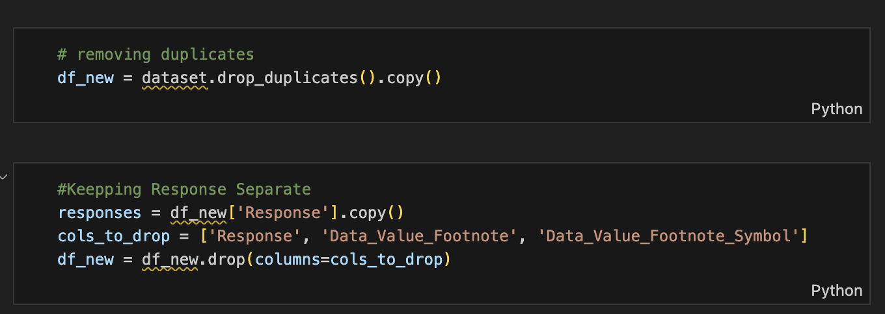
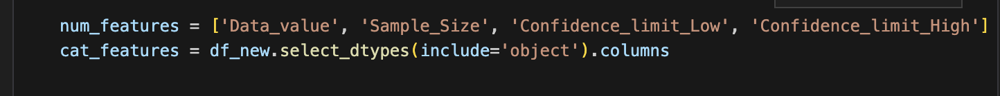
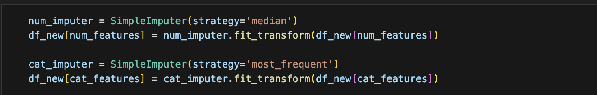
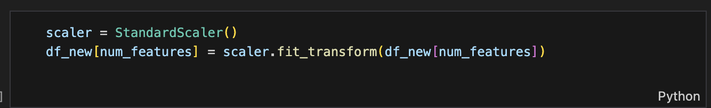
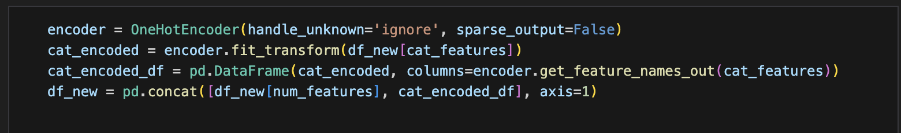
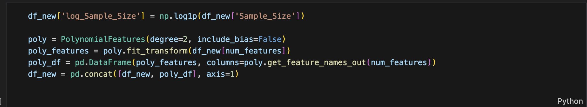
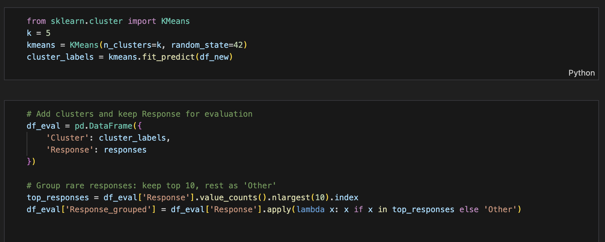
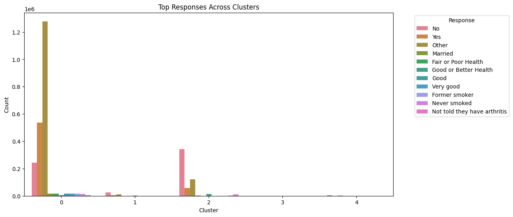
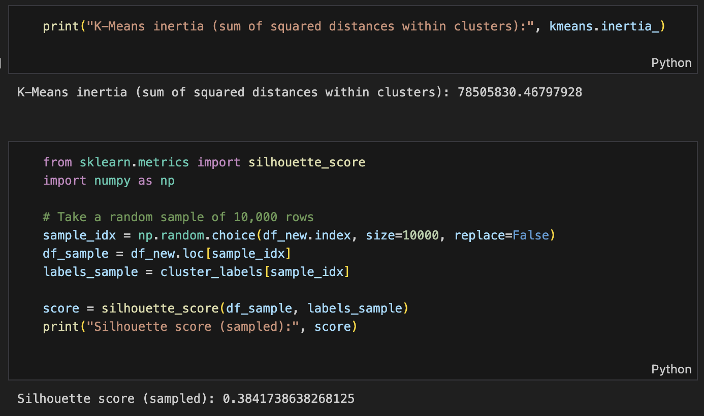
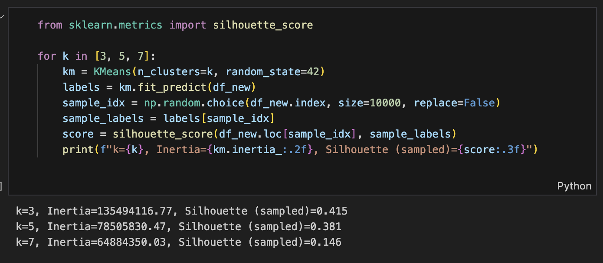

# Center for Disease Control and Prevention, Behavioral Risk Factor Surveillance System
## DSE 203 - Machine Learning
## Milestone 3 - Pre-Processing and First Model
### Dataset link
* https://data.cdc.gov/Behavioral-Risk-Factors/Behavioral-Risk-Factor-Surveillance-System-BRFSS-P/dttw-5yxu

### Jupter Notebook links
* https://github.com/MousumyCSE/CDC_BRFSS_project/blob/Milestone3/ML_project.ipynb
  
### Environment Setup Requirements

*This Jupyter Notebook is self-contained and can be run in most environments that support Jupyter Notebooks like Visual Studio Code or Google Colab.*

### Data Exploration
1. How many observations does your dataset have?

*Our dataest has 2,763,102 rows and 27 columns.*

2. Describe all columns in your dataset their scales and data distributions. Describe the categorical and continuous variables in your dataset. Describe your target column and if you are using images plot some example classes of the images.

*The target column we aim to utilize for our clustering analysis is **Responses**. Since we have data around demographic information like age, gender, race/ethnicity, and income, we want to group populations and predict their responses to survey questions.*
| Column | Description | Categorical or Continuous | Scale | Distribution |
| --- | --- | --- | --- | --- |
| Year | Year of survey response | Continuous  | 2011 - 2023 | Mostly evenly distributed |
| Locattionabbr | State abbreviation | Categorical | Nominal | Moslty evenly distributed except 'VI', 'UW', 'US' |
| Locationdesc | Full state name | Categorical | Nominal | Mostly evenly distributed except 'Virgin Islands', 'All states and DC' |
| Class | Class description for area of health | Categorical | Nominal | Almost half the data in 'Demographics', nearly 20% in 'Chronic Health Indicators' |
| Topic | Subclass, specific area of interest | Categorical | Nominal | Highest count from 'Disability status' of 176,818 and lowest count from 'Had CAT/CT Chest Scan' |
| Question | Question in survey | Categorical | Nominal | Highest count from 'Employment status?' of 140,716 and lowest count from 'Age 50-80 + former smoker + had CAT/CT scan in past year' of 2704 |
| Response | Response in survey | Categorical | Nominal | 43% of values are either 'Yes' or 'No' |
| Break_Out | Demographic category value like 'Male', '18-25' | Categorical | Nominal | Mostly evenly distributed except for unusual age group categories (46-55 and 45-54 are separate) |
| Break_Out_Category | Demographic category like 'Sex', 'Age' | Categorical | Nominal | 6 possible values, highest count in 'Race/Ethnicity' of 768,868, lowest count in 'Overall' of 116,860 |
| Sample_Size | Size of demographic in Break_Out_Category and Break_Out | Continuous | 0 - 37,492 | Mean is 639.16, 50% is 163 |
| Data_value | Percentage of Break_Out_Category and Break_Out make up total | Continuous | 0 - 100 | Mean value is 40.45% with a median of 28.6%. 50% of the data is less than 28.6 |
| Confidence_limit_Low | Low Confidence Limit | Continous | 0 - 100 | Mean value is 37.10 with a median of 23.8. 50% of data less than 68.9 |
| Confidence_limit_High | High Confidence Limit | Continous | 0 - 100 | Mean value is 43.8 with a median of  33.3. 50% of the data is less than 33.3 |
| Display_order | Display order | Continous | 1 - 4,493 | Nearly half of all values are 1 |
| Data_value_unit | Unit for Data_value_type | Categorical | Nominal | All values are '%' |
| Data_value_type | Data value type, such as age-adjusted prevalence or crude prevalence | Categorical | Nominal | All values are 'crude prevalence' |
| 16  Data_Value_Footnote_Symbol | Symbol denoting footnote | Categorical | Nominal | 3 possible values: *, **, *** |
| Data_Value_Footnote | Footnote text | Categorical | Nominal | 4 possible values, most frequently about prevalence estimate |
| DataSource | Survey name | Categorical | Nominal | All values are 'BRFSS' |
| ClassId | Class ID | Categorical | Nominal | Similar distribution as Class |
| TopicId | Topic ID | Categorical | Nominal | Similar distribution as Topic |
| LocationID | Location ID | Categorical | Nominal | Similar distribution as Location |
| BreakoutID | Breakout ID | Categorical | Nominal | Similar distribution as Break_Out |
| BreakOutCategoryID | Breakout Category ID | Categorical | Nominal | Similar distribution as Break_Out_Category |
| QuestionID | Question ID | Categorical | Nominal | Similar distribution as Question |
| ResponseID | Response ID | Categorical | Nominal | Similar distribution as Response |
| GeoLocation | Latitude and longitude of state | Numeric | Arrays of states' latitude and longitude | 105 possible values |

3. Do you have missing and duplicate values in your dataset? Note: For image data you can still describe your data by the number of classes, size of images, are sizes uniform? Do they need to be cropped? normalized? etc.

*Our dataset has a few columns that are entirely one value.*

*`DataSource` has only 'BRFSS'*

*`Data_Value_Footnote_Symbol` has only \*, \*\*, or \*\*\**

*`Data_value_unit` has only '%'*

*`Data_value_type` has only 'Crude Prevalence'.*

*`Data_Value_Footnote` and `Data_Value_Footnote_Symbol` has around 80% missing values. `Confidence_limits` columns has aroud 20% missing values and `Response` and   `Geolocation` has less than 1% missing values.*

*Out dataset does not have any duplicated rows.*

### Data Plots

1. Plot your data with various types of charts like bar charts, pie charts, scatter plots etc. and clearly explain the plots. For image data, you will need to plot your example classes.
   
   (i) Total data distributions between classes
    
   
   *Interpretation: This bar chart illustrates the total number of survey responses across different health classes, such as Women’s Health, Obesity, Cancer, Oral Health, Immunization, etc. The highest number of responses comes from the Demographics category, which covers topics like disability status, education, and employment. In contrast, the fewest responses are observed for Lung Cancer Screening.*

   (ii) 

   *Interpretation: The pie chart displays the top five survey responses, showing that “No” (≈50%) and “Yes” (≈48%) dominate the distribution, while “Not told they have arthritis,” “Good or Better Health,” and “Married” each contribute less than 2% of the total responses.*

   (iii) 

   *Interpretation: The scatter plot shows a strong positive relationship between the lower and upper confidence limits, with points closely following an upward trend. This indicates that as the lower limit increases, the upper limit also increases proportionally, and all upper limits remain above their corresponding lower limits, as expected.*

   (iv) 
   
   *Interpretation: After filtering the dataset to include only cancer-related topics, we found that Colorectal Cancer Screening accounts for the majority of survey results, whereas Lung Cancer Screening has the least representation based on race/ethnicity over the years.*

   (v) 
   
   *Interpretation: This choropleth map visualizes data filtered for Colorectal Cancer Screening — specifically, the Blood Stool Test for adults aged 50–75 who reported having the test within their past year for the year 2016.*

   (vi) 

   *Interpretation: The bar plot showing the top 10 states by average health behavior rate. Each bar represents a state or territory, with the height indicating its mean Data_value (in percentage). The plot highlights that the U.S. Virgin Islands (VI) has the highest average, followed by Guam (GU) and Washington, D.C. (DC), while the other states like Delaware (DE), Wisconsin (WI), and Vermont (VT) have slightly lower but similar averages. Overall, it visually ranks these locations by their health behavior performance.*

## Milestone 3
### Pre-processing
**Dropping columns**

*Response is our target for evaluation, not a feature for clustering. `Data_Value_Footnote` and `Data_Value_Footnote_Symbol` are dropped because these are mostly empty and not useful for clustering analysis.*

**Numeric vs Categorical Features**

*Since clustering algorithms require numeric inputs, the features are separated between numeric and categorical to apply the appropriate further preprocessing steps: scaling for numeric features and encoding for categorical features. For our dataset the numeric features are declared as `Data_value`, `Sample_Size`, `Confidence_limit_Low`, `Confidence_limit_High` and the other features are categorical.*

**Missing Value Handling**

*Any missing numeric values are replaced with the median, and any missing categorical values are replaced with the most frequently present value.*

**Scale Numeric Features**

*K-Means uses Euclidean distance, so features must be on the same scale which prevents numeric features with larger ranges from dominating the clustering.*

**Encode Categorical Features**

*K-Means works on numeric data only. Here we are using One-hot encoding which converts categorical features (like `Locationdesc` or `Class`) into binary columns. This ensures all categorical variables can be used in clustering.*

**Feature Transformation and Expansion**

*Log-transform reduces skewness in `Sample_Size`. Polynomial features create interaction terms and squared features which allows K-Means to detect more complex patterns.*

### First Model
## K-Means Clustering
*We're applying k-means clustering which partitions the data based on feature similarities. Groups of similar observations are formed into k clusters.*

*The target variable for our dataset is `Response`. The `Response` column has hundreds of unique values, plotting all would be messy. We keep the 10 most frequent responses and group the rest as "Other" to simplify analysis and visualization.*

*Interpretation: After applying K-Means clustering with 5 clusters, we examined the distribution of survey responses within each cluster. Cluster 0 represents the largest segment, containing a majority of "Other", "Yes", and "No" responses, indicating a diverse population with mixed responses. Cluster 2 also captures a large group but has a higher proportion of "No" responses, suggesting a population segment less likely to respond positively. Clusters 1, 3, and 4 are smaller and contain niche populations or outliers, with "No" dominating but with fewer overall responses.*

*These results indicate that K-Means successfully separates populations by general response patterns, with larger clusters representing the main population and smaller clusters highlighting specialized groups. This separation can help guide further analysis, targeting, or interventions based on demographic and survey features.*

**Model Evaluation**

*To evaluate cluster quality, we calculated the silhouette score on a random sample of 10,000 rows due to the dataset's size. The sampled silhouette score is 0.384, indicating that clusters are moderately well-separated. This aligns with the cluster distributions, where larger clusters capture the majority of responses and smaller clusters represent specialized or less frequent patterns. The score suggests that while clusters are meaningful, there is some overlap among populations, which is expected in survey data with diverse response.*

### Where does your model fit in the fitting graph?

**Model Fit**

*We trained K-Means with 5 clusters. Using the Elbow Method (plotting inertia vs. number of clusters), we chose k=5 where inertia starts to flatten, indicating that additional clusters do not significantly reduce intra-cluster distances. The sampled silhouette score of 0.384 shows moderate cluster separation, suggesting the model captures meaningful patterns without overfitting the dataset.*

*In terms of underfitting vs overfitting, underfitting would result in to few clusters → high inertia, low silhouette score. Overfitting would result in oo many clusters → very low inertia, but clusters may be meaningless (splitting natural groups unnecessarily). k=5 is a balance, representing main population segments without over-segmenting.*

**Test of Different Hyperparamters**

*We can compare different numbers of clusters, e.g., k=3 and k=7:*

*Interpretation: We tested K-Means with k = 3, 5, and 7 to analyze model fit. The silhouette score was highest for k=3 (0.415), indicating the best separation between clusters. While increasing k reduces inertia (cluster compactness), the silhouette score dropped at k=5 (0.381) and significantly at k=7 (0.146), showing that higher k values begin to overfit by creating overly fragmented clusters with poor separation. Therefore, k=3 provides the best balance between underfitting and overfitting and represents the optimal clustering configuration for this dataset.*

**Next Model**

*To further improve clustering performance and gain deeper insights into the data structure, several alternative models can be explored beyond K-Means. Hierarchical Clustering is a strong next candidate because it does not require pre-specifying the number of clusters and provides dendrogram visualizations that reveal natural groupings within the dataset, making it useful for exploratory analysis. DBSCAN is another promising approach as it is density-based and can detect clusters of arbitrary shapes while effectively identifying outliers as noise—something K-Means cannot handle well. Additionally, Gaussian Mixture Models (GMM) offer a probabilistic perspective by providing the likelihood of each point belonging to different clusters. Unlike K-Means, which assumes spherical clusters with equal variance, GMM can model elliptical clusters and overlapping groups more effectively. Exploring these methods is valuable because real-world survey data rarely conforms to the strict assumptions of K-Means; using more flexible models can better capture complex patterns, noise, and variability in the dataset.*

### Conclusion
What is the conclusion of your 1st model? What can be done to possibly improve it?

*The first model used for clustering was K-Means with five clusters, applied after completing data preprocessing. The model produced a silhouette score of approximately 0.38, indicating a moderate level of cluster separation. This suggests that the model was able to identify meaningful patterns and group individuals with similar demographic and response behaviors, although some overlap between clusters still exists. The inertia score further supported that the clusters created were reasonably compact. Analysis of the cluster distribution showed that one cluster contained a large portion of the data, while the remaining clusters represented smaller, more specific population groups, indicating that the dataset is somewhat imbalanced and certain response patterns dominate. Overall, K-Means served as a solid initial model for uncovering structure within the data; however, there is room for improvement. Model performance could likely be enhanced by experimenting with different values of k, trying alternative clustering techniques such as Hierarchical Clustering, DBSCAN, or Gaussian Mixture Models, and applying dimensionality reduction methods like PCA or t-SNE prior to clustering to better separate patterns in high-dimensional space. Additionally, addressing category imbalance or applying soft clustering may yield more refined and interpretable clusters.*
  
### Future work

Second model and final report

### Statement of collaboration

Mousumy Kundu

Aditi Das

Hayley Baek

